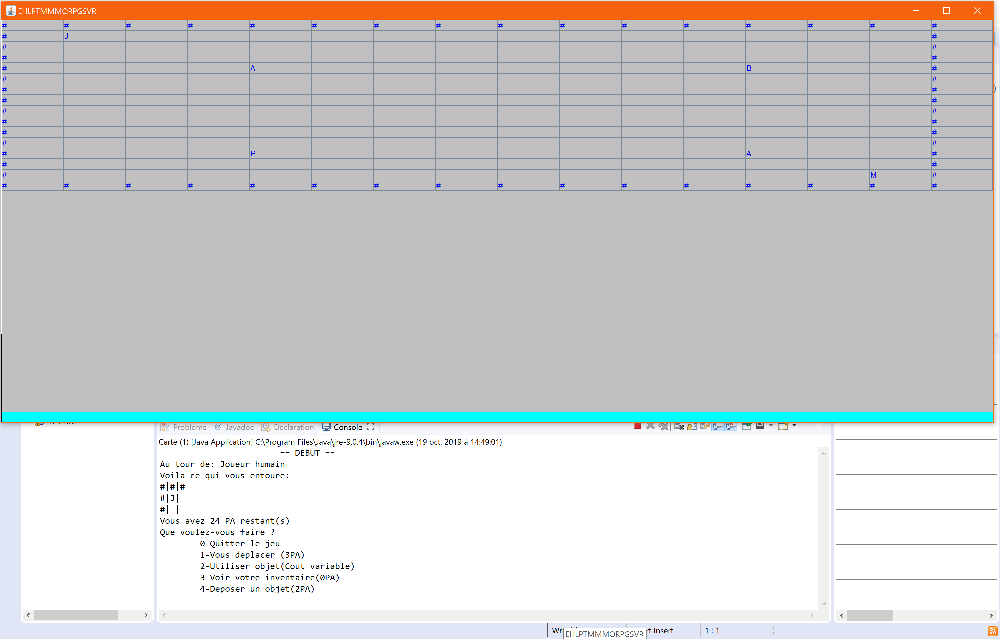
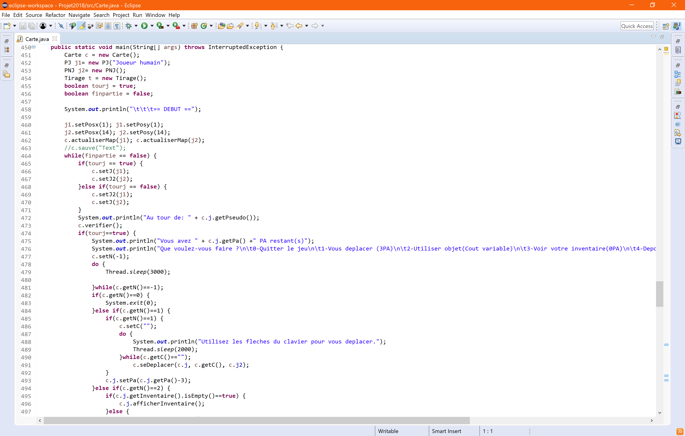
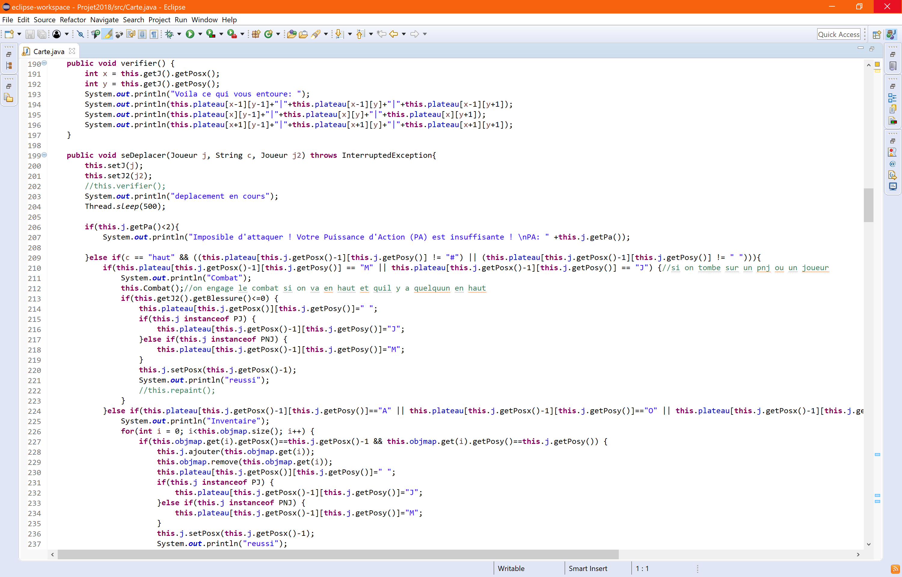

[PortFolio Morgan MINBIELLE](https://gerlarimin.github.io/PortFolioV1/)
========

> Auteur: [**_Morgan MINBIELLE_**](https://monportfolio-mm.000webhostapp.com/accueil/)
>
> Temps de lecture: **_\~ 7 minutes_**
>
> Version: **_`1.2.3`_**

> `v1.0` `Bootstrap 4.3` `CSS 3` `fontawesome 5.10` `HTML 5` `JavaScript` `jquery` `jquery-ui` `Mustache`
> [Code source](https://github.com/GerlariMin/PortFolioV1)
> [URL](https://gerlarimin.github.io/PortFolioV1/)

🚨 Cette version est obsolète, la dernière version est disponible [**_ici_**](https://github.com/GerlariMin/PortFolioV3) 🚨

---

## Table des matières
- [Résumé](#Résumé)
- [Détails](#Détails)
- [Arborescence](#Arborescence)
- [Code](#Code)
- [Historique](#Historique)
- [TODO](#TODO)
  ️
## Résumé

Première version de mon PortFolio sur laquelle j'ai voulu mettre en place un site web dynamique et utilisant le langage Mustache que j'ai vu en **L3**.  
Il s'agit d'une présentation sommaire de mes compétences, mon parcours et expériences.

## Détails

Chaque onglet (**`Accueil`, `Présentation`, `Parcours`, `Expériences`, `Compétences`, `Contact`, `CV`**) correspond à un bloc de code dans le fichier **_info.html_** dont l'**_id_** correspond à l'onglet qu'on veut afficher.
L'affichage est géré par le fichier **JavaScript _index.js_** qui est intégré au fichier **_index.html_** qui est l'**unique page d'affichage**. Le **contenu** est **dynamiquement ajouté** au bloc **_#container_** de l'**_index_**.  
Dans la même logique, les différents projets sont affichés dynamiquement à partir du fichier **_projets.html_** qui contient les différents blocs à afficher.  
Les différentes ressources utilisées pour ce site sont dans le répertoire **_`ressources/`_**, dans lequel existe plusieurs sous-répertoires en fonction du type de ressources (**`HTML`, `JavaScript`, `image`, ...**).

## Arborescence

- `ressources/`
    - `bootstap-4.3.1-dist/`
    - `fontawesome-free-5.10.2-web/`
    - `html/`
        - info.html
        - projets.html
    - `images/`
    - `js/`
        - index.js
        - jquery.js
    - `pdf/`
    - `projets/`
        - `apk/`
        - `images/`
        - `pdf/`
        - `zip/`
- index.php
- README.md

## Code

### index.html

```HTML
<!DOCTYPE html>
<html lang="fr" class="h-100 w-100">

<head>

    <meta charset="utf-8">

    <meta name="viewport" content="initial-scale=1.0; maximum-scale=1.0"/>

    <script src="ressources/js/jquery.js"></script>

    <link rel="stylesheet" href="https://stackpath.bootstrapcdn.com/bootstrap/4.3.1/css/bootstrap.min.css"
          integrity="sha384-ggOyR0iXCbMQv3Xipma34MD+dH/1fQ784/j6cY/iJTQUOhcWr7x9JvoRxT2MZw1T" crossorigin="anonymous">

    <script src="https://cdnjs.cloudflare.com/ajax/libs/popper.js/1.14.7/umd/popper.min.js"
            integrity="sha384-UO2eT0CpHqdSJQ6hJty5KVphtPhzWj9WO1clHTMGa3JDZwrnQq4sF86dIHNDz0W1"
            crossorigin="anonymous"></script>

    <script src="https://stackpath.bootstrapcdn.com/bootstrap/4.3.1/js/bootstrap.min.js"
            integrity="sha384-JjSmVgyd0p3pXB1rRibZUAYoIIy6OrQ6VrjIEaFf/nJGzIxFDsf4x0xIM+B07jRM"
            crossorigin="anonymous"></script>

    <script src="https://kit.fontawesome.com/d43c869f70.js"></script>

    <!--<script src="mustache.js-master/mustache.js"></script>-->

    <script src="ressources/js/index.js"></script>

    <link rel="icon" href="ressources/images/ico.png"/>

    <link rel="apple-touch-icon" href="ressources/images/ico.png"/>


    <title> PortFolio </title>

</head>


<body class="h-100">

<div class="card text-white bg-secondary rounded-lg mx-auto" style="height: 100%;">

    <div class="card-header  bg-secondary sticky-top">

        <nav id="navbar" class="navbar navbar-expand-lg navbar-light bg-light rounded-lg shadow-lg ">

            <a class="navbar-brand" href="#home">
                
            </a>

            <button class="navbar-toggler" type="button" data-toggle="collapse" data-target="#navbarNavDropdown"
                    aria-controls="navbarNavDropdown" aria-expanded="false" aria-label="Toggle navigation">
                <span class="navbar-toggler-icon"></span>
            </button>

            <div class="collapse navbar-collapse" id="navbarNavDropdown">

                <ul class="navbar-nav" data-target="#navbarNavDropdown" data-toggle="collapse">
                    <li class="nav-item">
                        <a class="nav-link" href="#presentation">Présentation <i class="fas fa-quote-left"></i></a>
                    </li>
                    <li class="nav-item">
                        <a class="nav-link" href="#parcours">Parcours <i class="fas fa-briefcase"></i></a>
                    </li>
                    <li class="nav-item">
                        <a class="nav-link" href="#experiences">Expériences <i class="fas fa-tasks"></i></a>
                    </li>
                    <li class="nav-item">
                        <a class="nav-link" href="#competences">Compétences <i class="fas fa-layer-group"></i></a>
                    </li>
                    <!--<li class="nav-item">
                        <a class="nav-link" href="#complements">Compléments <i class="fas fa-plus"></i></a>
                    </li>-->
                    <li class="nav-item">
                        <a class="nav-link" href="#contact">Contact <i class="fas fa-comments"></i></a>
                    </li>
                    <li class="nav-item">
                        <a class="nav-link" href="#cv">CV <i class="fas fa-graduation-cap"></i></a>
                    </li>
                </ul>

            </div>

        </nav>

    </div>

    <div id="container" class="card-body bg-light mx-0" style="overflow-x: unset;">
        <!-- Contiendra le code html récupéré par index.js -->
    </div>

    <div id="footer" class="card-footer text-center bg-dark text-white" aria-label="breadcrumb">
        <ol id="breadcrumb" class="breadcrumb">

        </ol>
        <p>© 2019 Copyright: MINBIELLE Morgan - <a href="#historique" class="text-decoration-none text-white">v1.2.3
            (historique des versions disponible ici)</a></p>
    </div>

</div>

</body>

</html>
```

### index.js

```JavaScript
function route(){

	var hash=window.location.hash;

	switch(hash){

		case("#cedr"):
			$.get("ressources/html/projets.html", function(reponse){
				content = $(reponse).filter("#cedr").html();
				$("#container").html(content);
			}, "html");
			break;
			
        case("#competences"):
			$.get("ressources/html/info.html", function(reponse){
				content = $(reponse).filter("#competences").html();
				$("#container").html(content);
				count_competences();
			}, "html");
			break;

		...

		default:
			$.get("ressources/html/info.html", function(reponse){
				content = $(reponse).filter("#home").html();
				$("#container").html(content);
			}, "html");
			break;

	}
}

function count_competences(){
	$('#badgeOne').html($('#collapseOne').children().eq(0).children().length);
	$('#badgeTwo').html($('#collapseTwo').children().eq(0).children().length);
	$('#badgeThree').html($('#collapseThree').children().eq(0).children().length);
}

function count_experiences(){
	$('#badgeOne').html($('#collapseOne').children().eq(0).children().length);
	$('#badgeTwo').html($('#collapseTwo').children().eq(0).children().length);
	$('#badgeThree').html($('#collapseThree').children().eq(0).children().length);
	$('#badgeFour').html($('#collapseFour').children().eq(0).children().length);
	$('#badgeFive').html($('#collapseFive').children().eq(0).children().length);
}

function breadcrumb(){
	
	var hash=window.location.hash;

	if(hash!=="#home" && hash!==""){
		if(hash=="#cedr" || hash=="#retrogames" || hash=="#ludema" || hash=="#loutrebay" || hash=="#portfolio" || hash=="#monkeyball" || hash=="#mmo" || hash=="#echecs"){
			$('#breadcrumb').html("<li class='breadcrumb-item'><a href='#home'>Home</a></li> <li class='breadcrumb-item'><a href='#experiences'>Expériences</a></li> <li class='breadcrumb-item active' aria-current='page'>"+hash.split('#')[1].substr(0,1).toUpperCase()+hash.split('#')[1].substr(1,hash.split('#')[1].length).toLowerCase()+"</li>");
		} else if(hash=="#experiences"){
			$('#breadcrumb').html("<li class='breadcrumb-item'><a href='#home'>Home</a></li> <li class='breadcrumb-item active' aria-current='page'>Expériences</li>");
		} else if(hash=="#competences"){
			$('#breadcrumb').html("<li class='breadcrumb-item'><a href='#home'>Home</a></li> <li class='breadcrumb-item active' aria-current='page'>Compétences</li>");
		} else if(hash=="#cv"){
			$('#breadcrumb').html("<li class='breadcrumb-item'><a href='#home'>Home</a></li> <li class='breadcrumb-item active' aria-current='page'>CV</li>");
		} else{
			$('#breadcrumb').html("<li class='breadcrumb-item'><a href='#home'>Home</a></li> <li class='breadcrumb-item active' aria-current='page'>"+hash.split('#')[1].substr(0,1).toUpperCase()+hash.split('#')[1].substr(1,hash.split('#')[1].length).toLowerCase()+"</li>");
		}
	} else{
		$('#breadcrumb').html("<li class='breadcrumb-item active' aria-current='page'>Home</li>");
	}
}

$(document).ready(function(){
	var container = document.getElementById("container");
    var navbar = document.getElementById("navbar");
    var footer = document.getElementById("footer");
    container.width = window.innerWidth-4;
    container.height = window.innerHeight-container.offsetTop-footer.offsetHeight-navbar.offsetHeight;
	route();
	breadcrumb();
	$(window).on("hashchange", function(){
		route();
		breadcrumb();
	});

});
```

### info.html
```HTML
<html>
    
    ...
    
    <div id="home">
    
        <div class="card mb-3 shadow-lg">
    
            <div class="row no-gutters">
    
                <div class="col-md-4">
    
                    
    
                </div>
    
                <div class="col-md-8">
    
                    <div class="card-body" style="margin-top: 50vh;transform: translateY(-50%);">
    
                        <center>
    
                            <h5 class="card-title text-dark"
                                style="font-size: xx-large; font-family: Avantgarde, TeX Gyre Adventor, URW Gothic L, sans-serif">
                                PORTFOLIO - MINBIELLE Morgan</h5>
    
                            <p class="card-text text-dark"
                               style="font-size: x-large; font-family: Avantgarde, TeX Gyre Adventor, URW Gothic L, sans-serif">
                                22 ans</p>
                            <p class="card-text"><small class="text-muted"
                                                        style="font-size: large; font-family: Avantgarde, TeX Gyre Adventor, URW Gothic L, sans-serif"><i
                                    class="fas fa-graduation-cap"></i> Étudiant en Licence Professionnelle Informatique (L3)</small>
                            </p>
    
                        </center>
    
                    </div>
    
                </div>
    
            </div>
    
        </div>
    
    </div>
    
    ...

</html>
```

### projets.html

```HTML
<html>
    
    ...
    
    <div id="mmo">
    
        <div class="card mb-3 shadow-lg h-100">
    
            <div class="row no-gutters">
    
                <div class="card-body text-dark">
    
                    <h5 class="card-title text-info"><i class="fas fa-dungeon"></i> MMORPG</h5>
    
                    <div class="row">
                        <div class="col-4">
                            <div class="list-group" id="list-tab" role="tablist">
                                <a class="list-group-item list-group-item-action font-weight-bold active"
                                   id="list-presentation-list" data-toggle="list" href="#list-presentation" role="tab"
                                   aria-controls="presentation">Présentation</a>
                                <a class="list-group-item list-group-item-action font-weight-bold"
                                   id="list-fonctionnalites-list" data-toggle="list" href="#list-fonctionnalites" role="tab"
                                   aria-controls="fonctionnalites">Fonctionnalités</a>
                                <a class="list-group-item list-group-item-action font-weight-bold" id="list-langages-list"
                                   data-toggle="list" href="#list-langages" role="tab" aria-controls="langages">Langages/
                                    Outils</a>
                                <a class="list-group-item list-group-item-action font-weight-bold" id="list-galerie-list"
                                   data-toggle="list" href="#list-galerie" role="tab" aria-controls="galerie">Galerie</a>
                                <a class="list-group-item list-group-item-action font-weight-bold" id="list-ressources-list"
                                   data-toggle="list" href="#list-ressources" role="tab" aria-controls="ressources">Ressources</a>
                            </div>
                        </div>
                        <div class="col-8">
                            <div class="tab-content" id="nav-tabContent">
                                <div class="tab-pane fade show active" id="list-presentation" role="tabpanel"
                                     aria-labelledby="list-presentation-list">
                                    <p class="text-justify text-monospace text-wrap">
                                        Ce projet consistait à développer un jeu de type MMORPG en JAVA avec une interface
                                        JFrame en binôme.
                                    </p>
                                </div>
                                <div class="tab-pane fade" id="list-fonctionnalites" role="tabpanel"
                                     aria-labelledby="list-fonctionnalites-list">
                                    <p class="text-justify text-monospace text-wrap text-info font-weight-bold">
                                        Le jeu doit:
                                    <ul class="list-group list-group-flush">
                                        <li class="list-group-item">Avoir une carte contenant des items différents (arme,
                                            bouvliers, potion)
                                        </li>
                                        <li class="list-group-item">Avoir une interface textuelle ou graphique pour le
                                            plateau
                                        </li>
                                        <li class="list-group-item">Effectuer un itrage au sort ayant un impact sur le
                                            déroulement du jeu
                                        </li>
                                        <li class="list-group-item">Permettre aux joueurs de se déplacer avec une saisie
                                            textuelle ou autre
                                        </li>
                                        <li class="list-group-item">Permettre au joueur d'effectuer différentes actions
                                            (déposer objet, se déplacer, attaquer)
                                        </li>
                                    </ul>
                                    </p>
                                </div>
                                <div class="tab-pane fade" id="list-langages" role="tabpanel"
                                     aria-labelledby="list-langages-list">
                                    <ul class="list-group list-group-flush">
                                        <li class="list-group-item"><i class="fas fa-edit"></i> Eclipse</li>
                                        <li class="list-group-item"><i class="fab fa-java"></i> JAVA</li>
                                        <li class="list-group-item"><i class="fab fa-java"></i> JFrame</li>
                                    </ul>
                                </div>
                                <div class="tab-pane fade" id="list-galerie" role="tabpanel"
                                     aria-labelledby="list-galerie-list">
    
                                    <div class="bd-example">
                                        <div id="carouselExampleCaptions" class="carousel slide" data-ride="carousel">
                                            <ol class="carousel-indicators">
                                                <li data-target="#carouselExampleCaptions" data-slide-to="0"
                                                    class="active"></li>
                                                <li data-target="#carouselExampleCaptions" data-slide-to="1"></li>
                                                <li data-target="#carouselExampleCaptions" data-slide-to="2"></li>
                                            </ol>
                                            <div class="carousel-inner">
                                                <div class="carousel-item active">
                                                    
                                                    <div class="carousel-caption d-none d-md-block">
                                                        <h5 class="text-dark bg-light rounded-lg">MMORPG - Jeu</h5>
                                                        <p class="text-dark bg-light rounded-lg">Interface du mini-jeu.</p>
                                                    </div>
                                                </div>
                                                <div class="carousel-item">
                                                    
                                                    <div class="carousel-caption d-none d-md-block">
                                                        <h5 class="text-dark bg-light rounded-lg">MMORPG - Main</h5>
                                                        <p class="text-dark bg-light rounded-lg">Extrait du code qui fait
                                                            tourner le mini-jeu.</p>
                                                    </div>
                                                </div>
                                                <div class="carousel-item">
                                                    
                                                    <div class="carousel-caption d-none d-md-block">
                                                        <h5 class="text-dark bg-light rounded-lg">MMORPG - Carte</h5>
                                                        <p class="text-dark bg-light rounded-lg">Extrait du code qui gère le
                                                            plateau.</p>
                                                    </div>
                                                </div>
                                            </div>
                                            <a class="carousel-control-prev bg-secondary" href="#carouselExampleCaptions"
                                               role="button" data-slide="prev">
                                                <span class="carousel-control-prev-icon" aria-hidden="true"></span>
                                                <span class="sr-only">Previous</span>
                                            </a>
                                            <a class="carousel-control-next bg-secondary" href="#carouselExampleCaptions"
                                               role="button" data-slide="next">
                                                <span class="carousel-control-next-icon" aria-hidden="true"></span>
                                                <span class="sr-only">Next</span>
                                            </a>
                                        </div>
                                    </div>
    
                                </div>
                                <div class="tab-pane fade" id="list-ressources" role="tabpanel"
                                     aria-labelledby="list-ressources-list">
                                    <blockquote class="blockquote">
                                        <p class="mb-0"><i class="fas fa-file-archive"></i> Archive</p>
                                        <footer class="blockquote-footer">
                                            <a href="ressources/projets/zip/MMO_JAVA.zip"
                                               class="text-decoration-none font-weight-bold"
                                               download="LoutreBay-Morgan-MINBIELLE">Dossier compressé <i
                                                    class="fas fa-download"></i></a>
                                        </footer>
                                    </blockquote>
                                </div>
                            </div>
                        </div>
                    </div>
    
                </div>
    
            </div>
    
        </div>
    
    </div>

    ...

</html>
```

## Historique

### `v1.2.3`
> Ajout de [**_Badges_**]() indiquant le nombre d'éléments que contienne les différentes catégories dans les onglets `Expériences` et `Compétences`.
>
> Date: **_14/12/2019_**

### `v1.2.2`
> Ajout d'un `Breadcrumb` (affichage de l'arborescence du site) au footer pour permettre à l'utilisateur de savoir où il se trouve sur le site.  
> La barre de navigation reste fixe, ainsi lorsque l'utilisateur fait défiler la page et peut choisir d'autres onglets plus rapidement.  
> Corrections mineures.
>
> Date: **_13/12/2019_**

### `v1.2.1`
> Actualisation des informations des onglets `Expériences` et `Compétences`.  
> Ajout de l'onglet de la description détaillée du projet `MonkeyBall``.
>
> Date: **_24/11/2019_**

### `v1.2.0`
> Ajout d'onglets de descriptions détaillées de projets (`CEDR`, `Échecs`, `LoutreBay`, `Ludéma`, `MMORPG`, `PortFolio`, `RetroGames`).
>
> Date: **_19/10/2019_**

### `v1.1.1`
> Mise à jour de l'onglet `Expériences`.
>
> Date: **_17/10/2019_**

### `v1.1.0`
> Ajout de l'onglet **_`CV`_**.
> Ajout d'un lien de téléchargement du CV dans l'onglet prévu à cet effet si jamais le lecteur PDF ne s'affiche pas sur la page.  
> Ajout d'un lien pour consulter le CV sur le site dans l'onglet **_`Contact`_**.  
> Ajout d'une redirection vers la boite mail lorsque l'on clique sur mon e-mail dans l'onglet **_`Contact`_**.  
> Ajout d'une redirection vers le téléphone lorsque l'on clique sur mon numéro dans l'onglet **_`Contact`_**.  
> 
> Date: **_16/10/2019_**

### `v1.0.1`
> Ajout de l'historique des versions du site.  
> Ajout des titres de pages pour pouvoir identifier quelle catégorie s'affiche à l'écran.  
> Masquage automatique de la barre de navigation pour pouvoir afficher l'ensemble d'une page sur l'écran d'un appareil mobile sans que le menu ne reste ouvert.  
> Modifications mineures concernant l'affichage.
>
> Date: **_16/09/2019_**

### `v1.0.0`
> Mise en place du PortFolio.
>
> Date: **_14/09/2019_**

## TODO 

Pages

- [x] Accueil
- [x] Présentation
- [x] Parcours
- [x] Expériences
- [x] Compétences
- [x] Contact
- [x] CV
- [x] Projets
